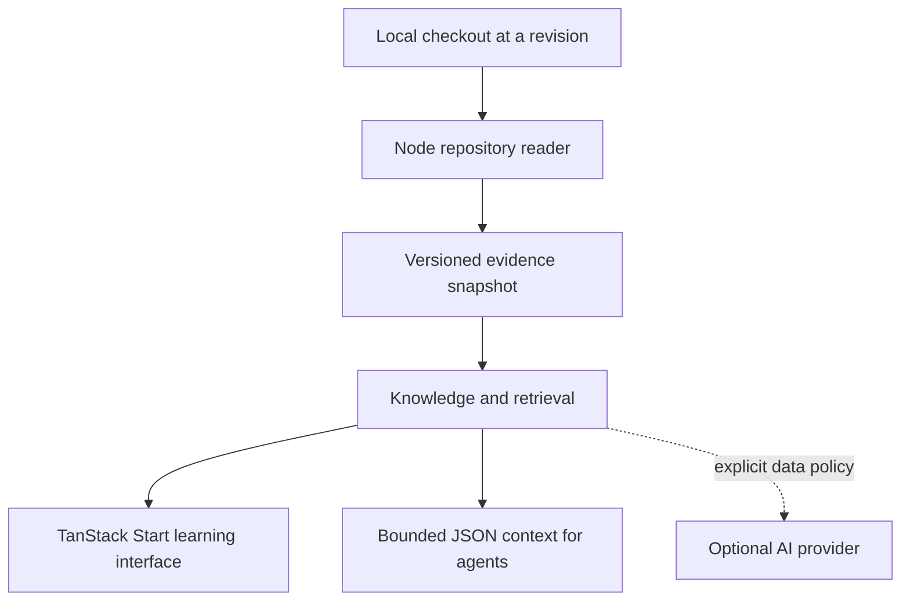

# Architecture

The current implementation contains a TanStack Start web shell, a help-only Node CLI, and a shared types package. Repository analysis and knowledge generation are documented boundaries awaiting implementation.

## Target flow

The diagram describes the planned product, not current services.

## Boundaries

`apps/web` owns the learning interface and its server handlers. TanStack Router owns navigation. Introduce Query for asynchronous server state, Table for large inventories, and Virtual for long source/history lists when the relevant feature arrives.

`apps/cli` will select a local checkout and run analysis. Long-running analysis should remain outside request/response handlers. Start with a single local process; move to a worker only when responsiveness and cancellation require it.

`packages/repository` will own Git and filesystem access, exclusions, size limits, history extraction, and stable evidence identifiers. It must not import UI or provider code.

`packages/knowledge` will consume snapshots and produce learning resources and retrieval results. Generated artifacts need model/prompt version, snapshot identity, citations, cost, and coverage metadata. A local JSON store is the proposed first persistence format; SQLite is a later option if query patterns justify it.

`packages/contracts` holds vocabulary shared between these boundaries. The existing types are preliminary compile-time contracts, not validated persisted schemas. Add runtime schemas with the first actual ingestion format.

## Data rules for the first implementation

- Identify evidence by repository, commit, path, and optional line range. Track omissions and truncation explicitly.
- Default to committed content at HEAD; report dirty files without ingesting them in the first slice.
- Treat symlinks, binary files, submodules, large blobs, and shallow history explicitly. Do not silently claim full coverage.
- Never execute repository code, Git hooks, filters, package scripts, or instructions embedded in source text.
- Constrain filesystem access to the selected repository and output directory. Disable shell interpolation for Git arguments.
- Write snapshots atomically and version their schema. Cancellation or failure must not expose partial snapshots as complete.
- Keep server-side content and secrets out of client bundles. Serve only deliberate projections.

## Tool choices

pnpm manages dependencies; Turborepo coordinates build dependencies and caches generated outputs. Vite and the TanStack Start plugin build the application. Nitro provides the Node production server, following TanStack's hosting guide. Its currently published release is a beta, pinned in the lockfile; production build and HTTP smoke checks guard integration upgrades.

TypeScript 5.9 is pinned as a conservative baseline. Biome provides formatting and linting. Node's built-in test runner covers smoke tests without adding a unit-test framework prematurely. Route generation runs before web type checks, so a clean checkout does not depend on having started the dev server.

No database, embeddings, provider SDK, MCP transport, or UI component library has been selected yet.
